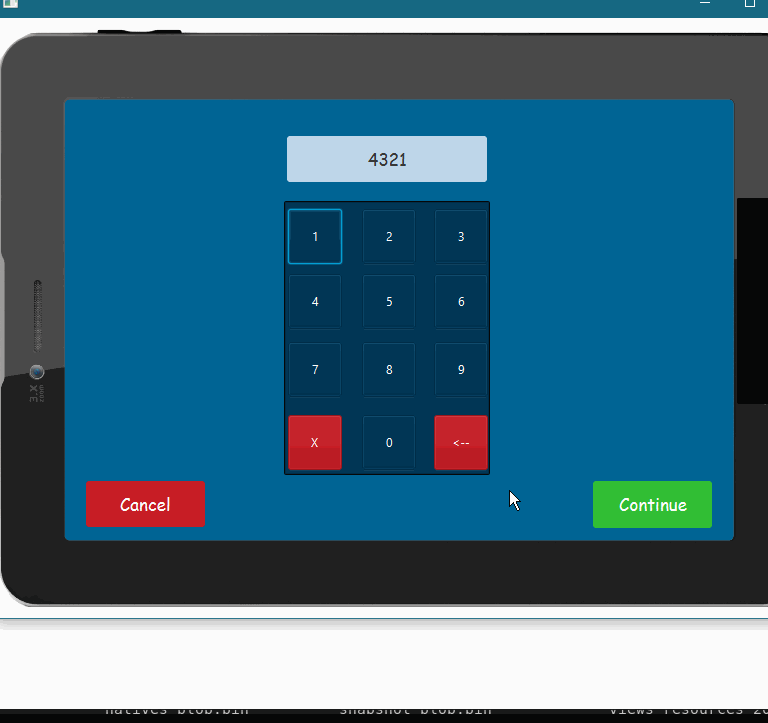

# EnhancedATM

*Fitness App*

**Fitness App** is an android app that tracks the users running distance and outputs statistics for calories, steps and distance 

Submitted by: **Syed Sadman**

*Quick Start*
- Click on the credit card to begin. The pin number is 4321
- Entering pin number backwards during withdrawal brings fake screen

The following features are implemented:

* [x] Users can click on virtual credit cards and proceed once pin is entered
* [x] Withdraw and deposit simulated currency and balance
* [x] Fake screen once pin number is entered backwards
* [ ] Enable automatic calling once in fake screen using TwilioAPI

## Notes
Equipped with a tablet UI, the ATM would be able to take pictures and send the user an email during a transaction for security purposes. At any time, if any components are being tampered with or removed, alarm will ring and ATM will lock down until owner uses key to stop it. During use, there is a security feature that activates when the user enters their pin number backwards during a transaction. This will anonymously alert the  police and present the user with a fake screen and print fake currency, tricking the thief. 

## License

    Copyright [yyyy] [name of copyright owner]

    Licensed under the Apache License, Version 2.0 (the "License");
    you may not use this file except in compliance with the License.
    You may obtain a copy of the License at

        http://www.apache.org/licenses/LICENSE-2.0

    Unless required by applicable law or agreed to in writing, software
    distributed under the License is distributed on an "AS IS" BASIS,
    WITHOUT WARRANTIES OR CONDITIONS OF ANY KIND, either express or implied.
    See the License for the specific language governing permissions and
    limitations under the License.

